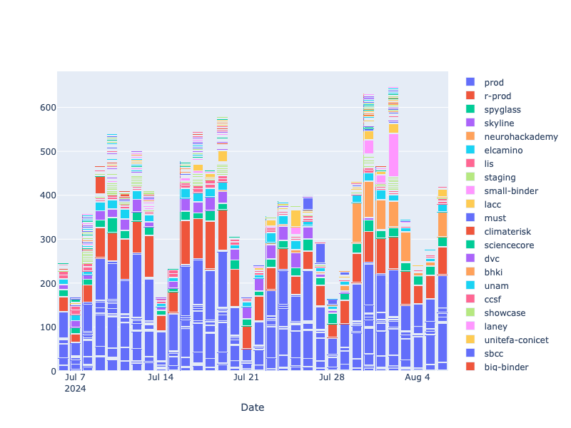

# Programmatically accessing Prometheus data

## Overview

Grafana is an open-source analytics and interactive visualization web application. Prometheus is an open-source monitoring and alerting platform that collects and stores metrics as time-series data, which feeds into Grafana as a data source.

Grafana dashboard deployments for 2i2c hubs (k8s+JupyterHub) follow the templates outlined in the upstream [JupyterHub GitHub repository](https://github.com/jupyterhub/grafana-dashboards). Note that Prometheus data is retained for up to 3 years on 2i2c hubs.

## Prerequisites

### Create a Grafana service account and generate a token

See [Grafana docs – Service Accounts](https://grafana.com/docs/grafana/latest/administration/service-accounts/) for more details.

1. Navigate to your Grafana instance (see the [List of Running Hubs](https://infrastructure.2i2c.org/reference/hubs/) table).
1. Open the *{octicon}`three-bars` Menu* and click on *{octicon}`gear` Administration > Users and access > Service accounts*.
1. Click on the {guilabel}`Add service account` button on the top-right.
1. Choose a descriptive *Display name*, e.g. `username-local-prometheus-access` and leave the role as *Viewer*. Click the {guilabel}`Create` button to confirm.
1. You will see a new page with the details of the service account you have created. In the section *Tokens*, click the {guilabel}`Add service account token` button to generate a token to authenticate with the Grafana API.
1. Choose a descriptive name for the token and then set a token expiry date. We recommend 1 month from now.[^token]
1. Click the {guilabel}`Generate token button` to confirm.
1. **Important:** Copy the token and keep a copy somewhere safe. You will not be able to see it again. Losing a token requires creating a new one.

[^token]: After the token expires, you will need to regenerate a new token and update its value in the local `.env` file and/or GitHub action secret.

### Configure Grafana Token access

See {ref}`managing-secrets` for a general guide to configuring access to the Grafana Token in a local development environment or while deploying with GitHub actions.

(hub-activity:python-packages)=
### Python packages

We require the following Python packages to run the code in this guide:

- `python-dotenv` – load environment variables defined in `.env` to your notebook session
- `dateparser` – parse human readable dates
- `prometheus-pandas` – query Prometheus and format into Pandas data structures
- `plotly` – visualize interactive plots

### Javascript

We require the [`plotly.js`](https://plotly.com/javascript/) Javascript library to render the interactive plotly graphs.

In your local development environment, enable the [`jupyter-dash`](https://github.com/plotly/jupyter-dash) extension for JupyterLab.

For Jupyter Book/MyST deployments, enable the following Javascript libraries in your configuration file:

```yaml
https://cdn.plot.ly/plotly-2.31.1.min.js", #  NOTE: load plotly before require.js
https://cdnjs.cloudflare.com/ajax/libs/require.js/2.3.4/require.min.js"
```

## Import packages and define functions

Import packages and set the Pandas plotting backend to the Plotly engine.

<!-- #region -->
```python
import os
import re
import requests
from dotenv import load_dotenv
from datetime import datetime
from dateparser import parse as dateparser_parse
from prometheus_pandas.query import Prometheus
import pandas as pd
import plotly.graph_objects as go

pd.options.plotting.backend = "plotly"
```
<!-- #endregion -->

Load the Grafana token as an environment variable from the `.env` file or GitHub/Read the Docs secret.

<!-- #region -->
```python
load_dotenv()
GRAFANA_TOKEN = os.environ["GRAFANA_TOKEN"]
```
<!-- #endregion -->

Define a `get_default_prometheus_uid` function to get the unique id of the Prometheus data source.

<!-- #region -->
```python
def get_prometheus_datasources(grafana_url: str, grafana_token: str) -> str:
    """
    Get the uid of the default Prometheus configured for this Grafana.
    
    Parameters
    ----------
    grafana_url: str
        API URL of Grafana for querying. Must end in a trailing slash.

    grafana_token: str
        Service account token with appropriate rights to make this API call.
    """
    api_url = f"{grafana_url}/api/datasources"
    datasources = requests.get(
        api_url,
        headers={
            "Accept": "application/json",
            "Content-Type": "application/json",
            "Authorization": f"Bearer {grafana_token}",
        }
    )
    # Convert to a dataframe so that we can manipulate more easily
    df = pd.DataFrame.from_dict(datasources.json())
    # Move "name" to the first column by setting and resetting it as the index
    df = df.set_index("name").reset_index()
    # Filter for sources with type prometheus
    df = df.query("type == 'prometheus'")
    return df
```
<!-- #endregion -->

Define the `get_pandas_prometheus` function that creates and Prometheus client and formats the result into a pandas dataframe.

<!-- #region -->
```python
def get_pandas_prometheus(grafana_url: str, grafana_token: str, prometheus_uid: str):
    """
    Create a Prometheus client and format the result as a pandas data stucture.

    Parameters
    ----------
    grafana_url: str
        URL of Grafana for querying. Must end in a trailing slash.
        
    grafana_token: str
        Service account token with appropriate rights to make this API call.
    
    prometheus_uid: str
        uid of Prometheus datasource within grafana to query.
    """

    session = requests.Session()  # Session to use for requests
    session.headers = {"Authorization": f"Bearer {grafana_token}"}

    proxy_url = f"{grafana_url}/api/datasources/proxy/uid/{prometheus_uid}/"  # API URL to query server
    return Prometheus(proxy_url, session)
```
<!-- #endregion -->

## Execute the main program


Fetch all available data sources from Prometheus.

<!-- #region -->
```python
datasources = get_prometheus_datasources("https://grafana.pilot.2i2c.cloud", GRAFANA_TOKEN)
```
<!-- #endregion -->

Define a query for the data source using [PromQL](https://prometheus.io/docs/prometheus/latest/querying/basics/), formatted as a string. The query below finds the maximum number of unique users over the last 24 hour period and aggregrates by hub name.

<!-- #region -->
```python
query = """
        max(
          jupyterhub_active_users{period="24h", namespace=~".*"}
        ) by (namespace)
        """
```
<!-- #endregion -->

:::{note}

Writing efficient PromQL queries is important to make sure that the query actually completes, especially over large periods of time. However, most queries users of JupyterHub are bound to make are fairly simple, and you don't need to be a PromQL expert.

You can borrow a lot of useful queries from the GitHub repository [jupyterhub/grafana-dashboards](https://github.com/jupyterhub/grafana-dashboards), from inside the `jsonnet` files. The primary thing you may need to modify is getting rid of the `$hub` template parameter from queries.
:::

Loop over each datasource, test the connection to the hub and then call the `get_pandas_prometheus()` function to create a Prometheus client for querying the server with the API. Evaluate the query from the last month to now with a step size of 1 day and output the results to a pandas dataframe. Save each output into an `activity` list item and then concatenate the results together at the end.

<!-- #region -->
```python
activity=[]
# datasources = datasources.drop([0], axis=0)  # Remove support server
for prometheus_uid in datasources['uid']:
    # Test connection to hub
    try:
        r = requests.get(datasources.loc[datasources['uid']==prometheus_uid, 'url'].values[0])
    except requests.exceptions.RequestException as err:
        print(f"{datasources.loc[datasources['uid']==prometheus_uid, 'name'].values[0]}: Error {err}")
        continue
    # Query Prometheus server
    prometheus = get_pandas_prometheus("https://grafana.pilot.2i2c.cloud", GRAFANA_TOKEN, prometheus_uid)
    try:
        df = prometheus.query_range(
            query,
            dateparser_parse("1 month ago"),
            dateparser_parse("now"),
            "1d",
        )
    except ValueError as err:
        print(f"datasources.loc[datasources['uid']==prometheus_uid, 'url'].values[0]: Error {err}")

    activity.append(df)
df = pd.concat(activity)
```
<!-- #endregion -->

## Pre-process and visualize the results

Round the datetime index to nearest calendar day.

<!-- #region -->
```python
df.index = df.index.floor('D')
```
<!-- #endregion -->

Rename the hubs from the raw data, `{namespace="<hub_name>"}`, to a human readable format using regex to extract the `<hub_name>` from the `"` double-quotes.

<!-- #region -->
```python
df.columns = [re.findall(r'[^"]+', col)[1] for col in df.columns]
```
<!-- #endregion -->

Sort hubs by most number of unique users over time.

<!-- #region -->
```python
df = df.reindex(df.sum().sort_values(ascending=False).index, axis=1)
```
<!-- #endregion -->

### Unique users in the last 24 hours


Plot the data! 📊

<!-- #region -->
```python
fig = go.Figure()
for col in df.columns:
    fig.add_trace(go.Bar(
        x=df.index,
        y=df[col],
        name=f"{col}",
        )
    )
fig.update_layout(
    xaxis_title="Date",
    width=800,
    height=600,
    legend=dict(groupclick="toggleitem"),
    barmode='stack',
    legend_traceorder="normal",
    )
fig.show()
```
<!-- #endregion -->

