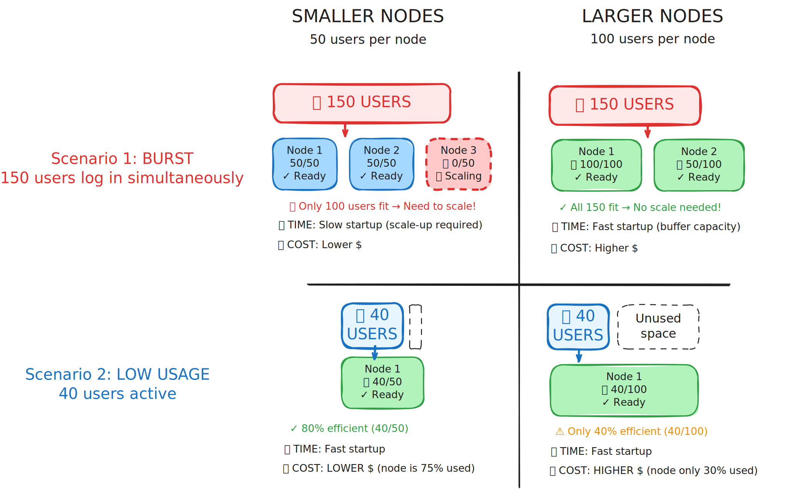

(community-lead:billing:responsiveness)=
# How to balance cloud responsiveness and cost

There is a tradeoff between how responsive a hub is and its cost. This is primarily determined by the **size of the nodes** that are used for user sessions.

**Larger nodes** can fit more users on a single node, which means:
- ✅ Lower cost per user (better resource efficiency)
- ❌ Slower to start new nodes when demand spikes (takes longer to scale up)
- ❌ Longer wait times for users when the hub is busy

**Smaller nodes** fit fewer users per node, which means:
- ✅ Faster to start new nodes (more responsive to demand spikes)
- ✅ Shorter wait times for users
- ❌ Higher cost per user (less resource efficiency)

## Visual example

The diagram below shows this tradeoff. In both scenarios, we have 10 active users:

**Large nodes** (left):
- 2 nodes handle all 10 users efficiently
- If an 11th user arrives, a whole new large node must start (slower, more capacity than needed)

**Small nodes** (right):
- 5 nodes handle the same 10 users
- If an 11th user arrives, a small node starts quickly (faster, right-sized capacity)
- But 5 nodes cost more than 2 nodes for the same users

### Real-world example

Many 2i2c hubs use a **balanced approach**:
- Start with medium-sized nodes for general use
- Have the ability to provision smaller nodes for quick scaling during peak times
- Allow specific high-memory users to request larger dedicated nodes

This provides reasonable responsiveness while keeping costs manageable. The 2i2c engineering team works with communities to find the right balance for their usage patterns.