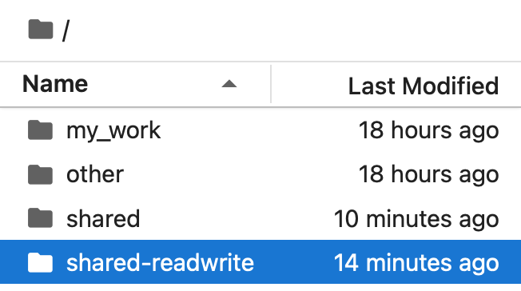

# Share data files with your users

Sometimes Hub Admins might need to distribute a set of files to all users, rather than each user re-downloading the same dataset. This is particularly useful for educational use cases, where you might be teaching a course that reads a common dataset.

:::{tip}
If you are teaching with large datasets, you might run out of
memory! So consider teaching with just a subset of data before
distributing large datasets to your users.
:::

## The `shared` directory

There are two folders that are used together to allow administrators to
share data files with all users.

`shared`
: All users have a directory called `shared` in their home directory.
  This is a **read-only** directory - users and administrators can not write to it. However, anybody can *read* from the `shared` directory.

```{note}

The `shared-readwrite` folder appears for Hub Admins only.
```

`shared-readwrite`
: **(administrators only)** Admins also have a directory called `shared-readwrite` in their home directory. This is the *same folder* as the `shared` directory, but writeable! Any file admins write here will be immediately visible in all users' `shared` directories.

### Example workflow

To share datasets with users, Hub Admins should place the dataset in the `~/shared-readwrite` directory. If they are distributing notebook / content that *reads* this dataset, it should refer to files in the `~/shared/` that is readable by all Hub Users and *not* `~/shared-readwrite`. This will prevent accidental deletion or overwriting between Hub Admins.

:::{tip}
It is the responsibility of the Hub Admins delete files in the `shared-readwrite` directory when no longer needed to minimize cloud billing costs. Hub Admins are responsible for managing storage costs and files stored in `shared-readwrite`.
:::

## The `shared-public` directory

:::{note}
Available upon request
:::

The `shared-public` directory is available with read/write access to *all* Hub Users. Any user can create, read, update and delete files in this folder. Hub Admins should caution their users to take greater care not to overwrite or delete other people's work.

:::{tip}
It is the responsibility of the Hub Admins delete files in the `shared-public` directory when no longer needed to minimize cloud billing costs. Hub Admins are responsible for managing storage costs and files stored in `shared-public`.
:::

## The `allusers` directory

:::{note}
Available upon request
:::

Hub Administrators might need to share data files with the users,
and this files must only be visible to the users that they're addressed to.
For example, uploading graded notebook assignments in each user's home directory.

They may also need to access all users' home directories to perform administrative tasks, such as cleaning up files or managing user data.

If such a workflow is needed, then an additional `allusers` directory can be enabled for **administrators only**, where all the Hub users' directories are accessible to read and modify. Please reach out to us if you'd like this feature enabled.

```{caution}
This feature should be used with extra caution! Please keep in mind that this feature enables admins to access all users' home directories.

Performing administrative actions as a Hub Admin should be done with great care. Respect the privacy of others and think before you act. 
```
